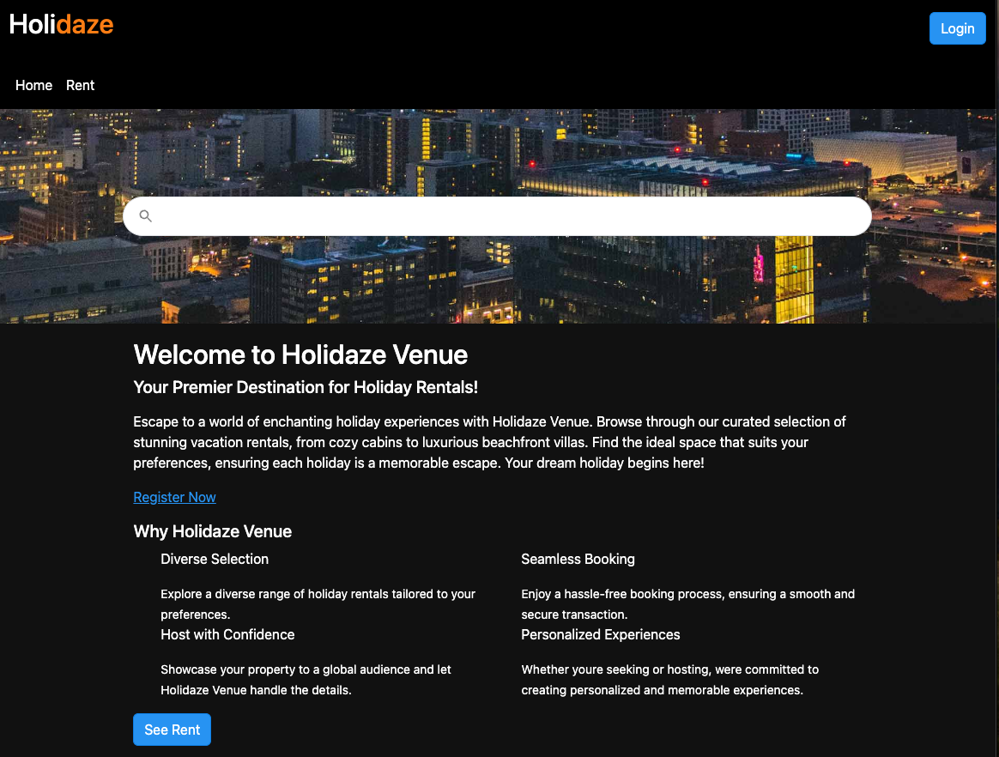

# Holidaze 


## Description

Holidaze is an innovative accommodation booking platform that allows users to discover and book their ideal holiday rental. This project involves creating a robust front-end for the Holidaze application, focusing on both the customer-facing side for booking holidays and the admin-facing side for venue management.


## Built With

Here, you can find tech waste used to build this site.

- [react](https://react.dev/)
- [react-bootstrap](https://react-bootstrap.netlify.app/)
- [react-datepicker](https://www.npmjs.com/package/react-datepicker)
- [react-search-autocomplete"](https://www.npmjs.com/package/react-search-autocomplete)
- [react-select](https://www.npmjs.com/package/react-select)
- [react-hook-form](https://www.npmjs.com/package/react-hook-form)
- [react-select](https://www.npmjs.com/package/react-select)
- [bootstrap](https://getbootstrap.com/)
- [sass](https://www.npmjs.com/package/sass)
- [date-fns](https://date-fns.org/)
- [yup](https://www.npmjs.com/package/yup)


## Getting Started

### Installing
requirement
- [nodejs](https://nodejs.org/en)

First thing you need is Clone the Repo

 ```
   git clone git@github.com:nexnic/YourStore.git 
```

Let install dependency

```
npm run install
```

### Run

Let run this local 
```
npm run dev
```
This will now run local network can be access from device 

# Contact

This is where you can leave your social links for people to contact you, such as a LinkedIn profile or Twitter link e.g.

```
ToDo
```